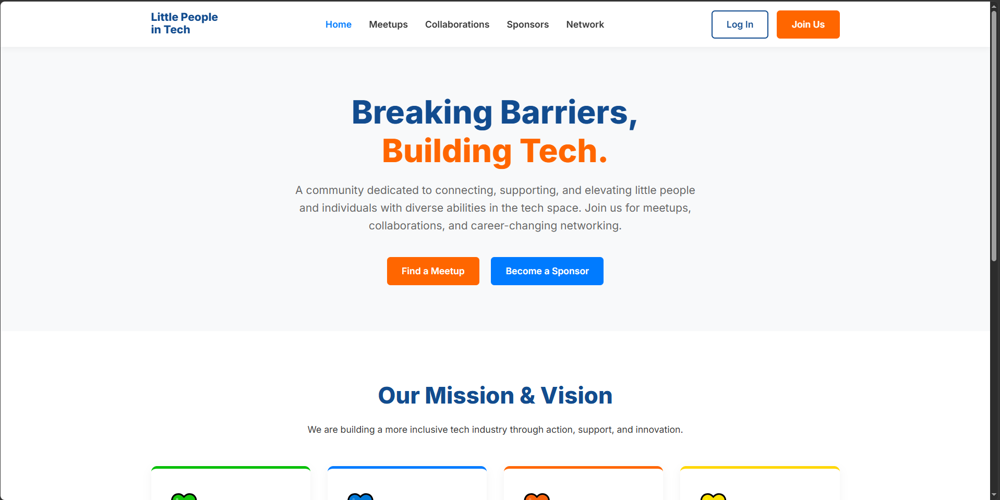

# Little People in Tech (LPiT) 🌐


*(Note: Replace `replace-this-with-your-image-path.png` with the actual file name of your homepage screenshot, e.g., `assets/home-preview.png`)*

## About The Project
**Little People in Tech** is a grassroots community platform designed to break down barriers, increase representation, and foster meaningful connections for people of short stature in the technology sector. 

This platform serves as a central hub where members can find accessible networking events, discover open-source collaborations, seek mentorship, and connect with inclusive sponsors. 

### Core Values & Color Palette
Our UI is driven by our community values:
* **Blue:** Inclusion & Support (Community Networking)
* **Green:** Accessibility (Universal Design Initiatives)
* **Yellow:** Neurodiversity (Embracing Unique Perspectives)
* **Orange:** Representation & Action (Sponsorships & Mentorship)

## Key Features
* **Meetups Board:** Find and host virtual and accessible in-person tech events.
* **Collaborations Hub:** Connect with open-source projects, find co-founders, or request mentorship.
* **Sponsor Gateway:** Tiered partnership opportunities for companies looking to hire diverse talent and support accessibility.
* **Secure Networking:** Custom user authentication (Login/Signup) allowing members to securely access the community directory.

## Built With
* **Front-end:** HTML5, CSS3 (Custom responsive grid and UI)
* **Back-end:** PHP 8.x
* **Database:** MySQL (PDO for secure, prepared statements)
* **Security:** Native PHP Password Hashing (`password_hash`)

---

## Getting Started (Local Development)

To get a local copy up and running, follow these steps.

### Prerequisites
You will need a local server environment that supports PHP and MySQL, such as **XAMPP**, **MAMP**, or **WAMP**.

### Installation

1. **Clone the repository**
   ```bash
   git clone [https://github.com/your-username/little-people-in-tech.git](https://github.com/your-username/little-people-in-tech.git)
